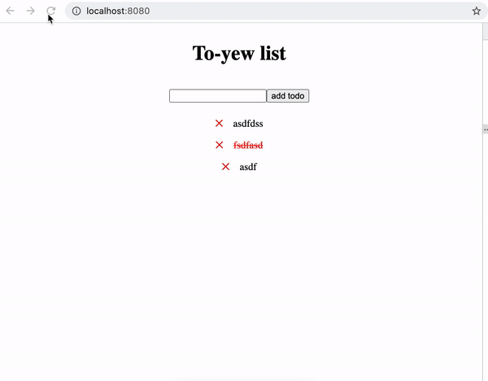

To run locally:

```
//can skip if you already have these
rustup target add wasm32-unknown-unknown   
cargo install trunk wasm-bindgen-cli

// pretty sure this is called on trunk serve
cargo build

// else just this should be ok
trunk serve
```

how it looks: 



contains 
- simplified [yew](https://github.com/yewstack/yew) demo for to do mvc
- local storage
- [css-in-rust](https://github.com/lukidoescode/css-in-rust) (via a [non-official distribution](https://github.com/lukidoescode/css-in-rust/pull/37) that hasn't been merged into master to support yew 0.18.0)