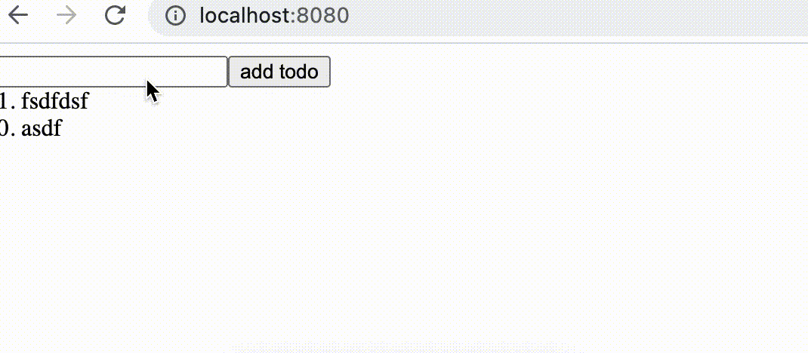

To run locally:

```
//can skip if you already have these
rustup target add wasm32-unknown-unknown   
cargo install trunk wasm-bindgen-cli

// else just this should be ok
cargo build
trunk serve
```

how it looks: 

